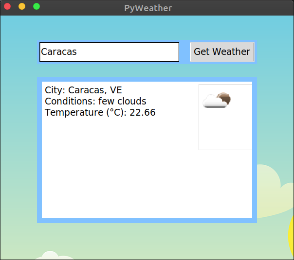

# PyWeatherTk

A Python 3 GUI application (made with Tkinter) that uses the [OpenWeatherMap](https://openweathermap.org/) API to present current weather conditions in the entered city.

Based on [this video tutorial](https://youtu.be/D8-snVfekto) by Keith Galli ([Github repo](https://github.com/KeithGalli/GUI) | [Twitter](https://twitter.com/keithgalli))

